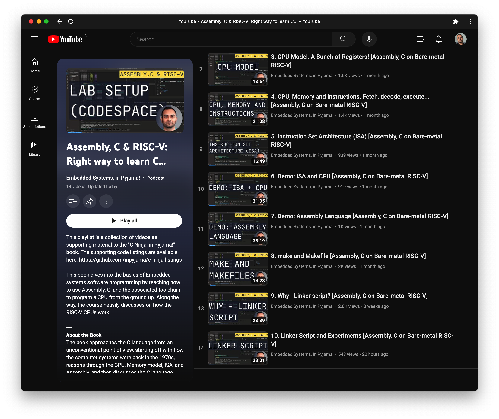

```
The code provided as part of this repository is ONLY for learning purposes!
```

# Code Listings for "C-Ninja, in Pyjama!"

This repository contains code listings cited as examples from the book "**C Ninja, in Pyjama!**". There is also supporting YouTube playlist that guides through the chapters and concepts.

<figure>
  <a href="https://www.youtube.com/playlist?list=PLFt5JBAXXlQow0PLTdqvaiIUMRa71VQHl" target="_blank">
    
    <figcaption align = "center">Embedded Systems 101: C Ninja, in Pyjama! The right way to learn C...</figcaption>
  </a>
</figure>


# Environment Setup

All the examples are based on the RISC-V CPU implementing the **rv32i** instruction set. To avoid having to procure/purchase new hardware, the examples are based on the QEMU emulator that emulates the intended CPU. This makes it easy to learn all the core concepts first before trying to execute them on a real hardware.

To ensure that everyone has the same development environment, we create and use a docker container. Following steps guide on setting up the right docker container locally.

## 1. Setup Docker Container

You would need to have Docker engine/desktop installed and running. If you don't already have it, get a copy and install it for your Operating system by following steps here: [Docker](https://www.docker.com).

### 1.1. Mac OS and Linux

Execute the following to run the setup after [Docker](https://www.docker.com) is installed and actively running on your local machine.

```bash
bash setup.sh
```

#### 1.1.1. Testing the container

<figure>
  
  <figcaption align = "center">Example of correctly setup environment...</figcaption>
</figure>

Open a new terminal window. If you are using the `bash` shell then simply execute the following:
```bash
c-ninja
```

<b style="color:red">Important:</b> If you are using some other shell, please change to the `bash` shell first by executing the `bash` command! Once you are in the bash shell is activated, execute the `c-ninja` command.

Once within the docker container, execute the following:

```bash
c-ninja@c-ninja-linux ~/Documents
% cd test
c-ninja@c-ninja-linux ~/Documents/test
% make
```

You should see prints as below:

```bash
riscv64-unknown-elf-gcc  -O0 -ggdb -nostdlib -march=rv32i -mabi=ilp32 -Wl,-Tmain.ld main.s -o main.elf
riscv64-unknown-elf-objcopy -O binary main.elf main.bin
xxd -e -c 4 -g 4 main.bin
00000000: 00100093  ....
```

### <b style="color:red">1.2. Linux Host Only: Change Ownership of the directory!</b>

If you are on a Linux based host machine then you will need to change the ownership of the contents within ~/Documents/ in the container. Execute the command as shown below:

```bash
c-ninja@c-ninja-linux ~/Documents
% sudo chown -R c-ninja .
```

This will change the ownership of the files to the local user `c-ninja` within the docker container. After this you should be able to issue `cd test; make` and see the same results as noted in the image above.

### 1.3. Windows

Execute the following to run the setup after [Docker](https://www.docker.com) is installed and actively running on your local machine. You can either double-click this file or execute it from the `cmd`/`power shell` prompt. This command has been tested on Windows 11.

```bash
setup.bat
```

These commands should download the required Linux image, create a container using it, install all the required packages, create the `c-ninja` user, and map the current directory as the `~/Documents`

#### 1.3.1. Testing the installation

You should see a new, `c-ninja.bat` file generated in the current directory. You can double-click on the file to launch the terminal connected to the docker container.

## 2. Setup VScode
- [Download and Install Vscode](https://code.visualstudio.com/download) for your operating system.
- Launch VScode, open the terminal, and install the extensions -
```bash
code --install-extension ms-vscode-remote.remote-containers
code --install-extension ms-vscode-remote.remote-ssh
code --install-extension ms-vscode-remote.remote-ssh-edit
code --install-extension ms-vscode.remote-explorer
code --install-extension zhwu95.riscv
code --install-extension ZixuanWang.linkerscript
```
- Restart VSCode and from the Remote explorer connect to the container.

# Copyright

Copyright © 2023 inpyjama.com. All Rights Reserved.
